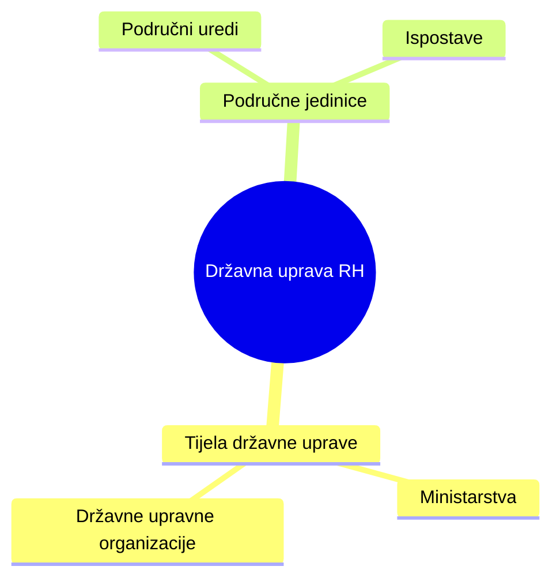
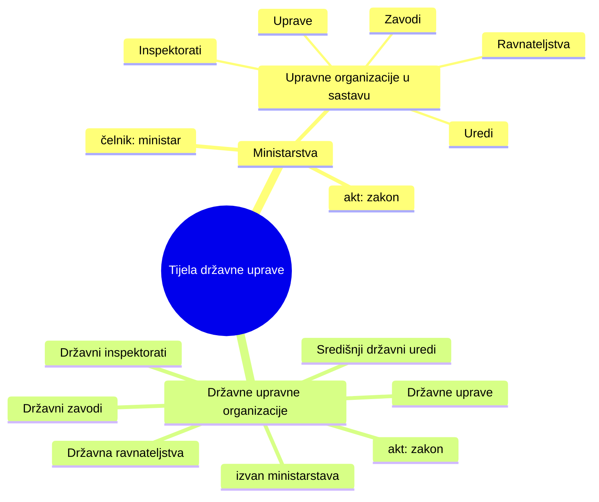
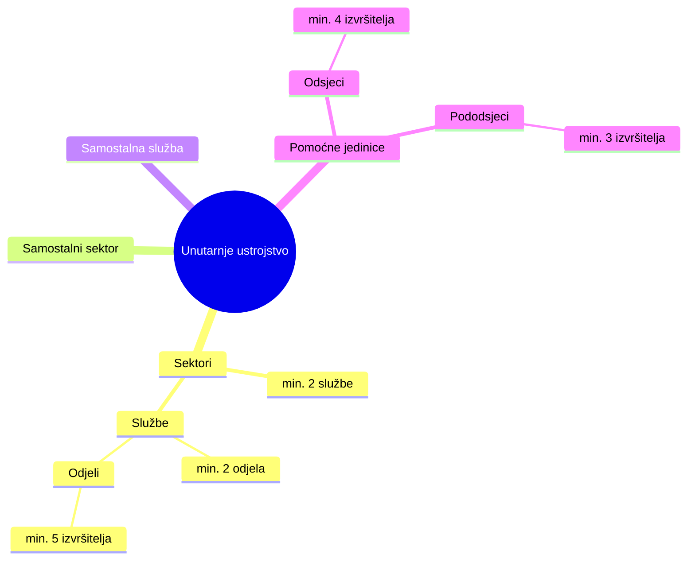

## 1️⃣ Sustav državne uprave – pregled

## 2️⃣ Tijela državne uprave

## 3️⃣ Unutarnje ustrojstvene jedinice

| Kategorija   | Tijelo                       | Je li tijelo državne uprave | Gdje je ustrojeno  | Akt ustrojavanja | Čelnik            | Odgovara |
| ------------ | ---------------------------- | --------------------------- | ------------------ | ---------------- | ----------------- | -------- |
| Ministarstvo | Ministarstvo                 | ✅ DA                        | Samostalno         | Zakon            | Ministar          | Vladi    |
| DUO          | Državna upravna organizacija | ✅ DA                        | Izvan ministarstva | Zakon            | Državni dužnosnik | Vladi    |
| UOM          | Uprava                       | ❌ NE                        | U ministarstvu     | Uredba           | Ravnatelj         | Ministru |
| UOM          | Zavod                        | ❌ NE                        | U ministarstvu     | Uredba           | Ravnatelj         | Ministru |
| UOM          | Inspektorat                  | ❌ NE                        | U ministarstvu     | Uredba           | Glavni inspektor  | Ministru |

| Što se uređuje | Akt | Donositelj |
|---------------|-----|------------|
| Djelokrug i ustrojstvo | Zakon | Hrvatski sabor |
| Opća pravila ustrojstva | Uredba | Vlada RH |
| Unutarnje ustrojstvo tijela | Uredba | Vlada RH |
| Unutarnji red | Pravilnik | Čelnik tijela |
