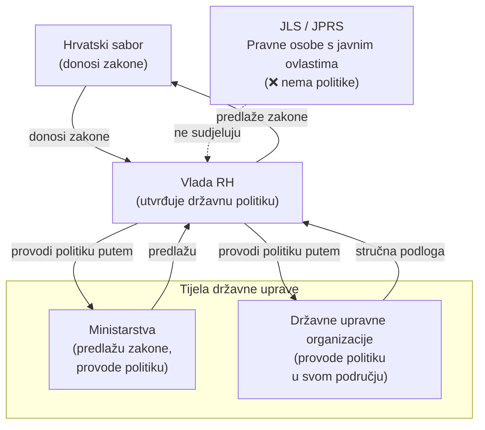

# Provedba državne politike

---

## 1. Pojam

**Provedba državne politike** obuhvaća poslove državne uprave:
- kojima se omogućuje izvršavanje ovlasti **Vlade Republike Hrvatske**
- utvrđenih **člankom 113. Ustava RH**

### Cilj
- provođenje zakona
- usmjeravanje i vođenje državne politike

> [!WARNING] 
> **Ispitno bitno**
>   
> Provedba državne politike vezana je uz **ustavne ovlasti Vlade RH (čl. 113.)**

---

## 2. Poslovi provedbe državne politike

**Provedba državne politike** obuhvaća sljedeće poslove državne uprave:

- izrada **nacrta prijedloga zakona**
- izrada **prijedloga uredbi**
- izrada **prijedloga drugih akata Vlade RH**

---

### Strateški i planski dokumenti
- izrada nacrta **strateških dokumenata**
- izrada nacrta **planskih dokumenata**

Primjer:
- provedbeni program ministarstva

---

### Praćenje provedbe propisa
- praćenje **učinkovitosti provedbe**:
  - zakona
  - uredbi
  - drugih akata Vlade RH

---

### Međunarodna i EU dimenzija
- **zastupanje Republike Hrvatske**:
  - u tijelima Europske unije
  - u međunarodnim organizacijama
- obavljanje **europskih poslova**
- ostvarivanje **međunarodne suradnje**
  - sukladno posebnom zakonu

---

## 3. Provedba državne politike – ponavljanje

Provedba državne politike obuhvaća:
- izradu nacrta prijedloga **zakona**
- izradu **strateških i planskih dokumenata**
- praćenje provedbe propisa
- **zastupanje RH** u tijelima EU i međunarodnim organizacijama
- europske poslove i **međunarodnu suradnju**

---

## 4. Tko obavlja provedbu državne politike?

> [!WARNING] 
> **Ispitno pitanje**
>   
> Provedbu državne politike obavljaju:
> - **isključivo tijela državne uprave**

### Što to konkretno znači?

> [!NOTE]
> **Pod tijelima državne uprave podrazumijevaju se:**
> - **ministarstva**
> - **državne upravne organizacije**

❌ jedinice lokalne samouprave  
❌ jedinice područne (regionalne) samouprave  
❌ pravne osobe s javnim ovlastima  

➡ Provedba državne politike **ne može se povjeriti** drugim tijelima.

---

## 5. Zašto isključivo tijela državne uprave?

Radi se o poslovima koji omogućuju Vladi RH izvršavanje njezinih ustavnih ovlasti, i to:
- predlaganje zakona Hrvatskom saboru
- donošenje uredbi
- provođenje zakona
- vođenje unutarnje i vanjske politike
- usmjeravanje i nadzor rada državne uprave

➡ Ovi poslovi **ne mogu se povjeriti drugim tijelima**.

---

## 6. Metodološko-nomotehnička pravila

- nacrti prijedloga zakona
- prijedlozi drugih propisa
- prijedlozi općih akata Vlade RH

izrađuju se prema:
- **jedinstvenim metodološko-nomotehničkim pravilima**

### Donositelj
- **Hrvatski sabor**

---

## 7. Završno ponavljanje – ispitni tip

### Provedbu državne politike obavljaju:
- [x] tijela državne uprave
- [ ] jedinice lokalne samouprave
- [ ] jedinice područne (regionalne) samouprave
- [ ] pravne osobe s javnim ovlastima

### Poslovi provedbe državne politike uključuju:
- [x] izradu zakona i uredbi
- [x] strateške i planske dokumente
- [x] EU poslove i međunarodnu suradnju

---

## Sažetak – provedba državne politike

### Bit ideje
Provedba državne politike su **poslovi kojima tijela državne uprave omogućuju Vladi RH izvršavanje njezinih ustavnih ovlasti**  
(**čl. 113. Ustava RH**).

---

### Što sve spada u provedbu državne politike?
- izrada nacrta **prijedloga zakona**
- izrada **uredbi** i drugih akata Vlade RH
- izrada **strateških i planskih dokumenata**
- praćenje provedbe zakona i drugih propisa
- **EU poslovi i međunarodna suradnja**
- zastupanje RH u tijelima EU i međunarodnim organizacijama

---

### Tko obavlja provedbu državne politike?
➡ **isključivo tijela državne uprave**

❌ JLS / JPRS  
❌ pravne osobe s javnim ovlastima  

---

### Zašto samo tijela državne uprave?
Jer se radi o poslovima koji omogućuju Vladi RH:
- predlaganje zakona Saboru
- donošenje uredbi
- provođenje zakona
- vođenje unutarnje i vanjske politike
- usmjeravanje i nadzor rada državne uprave

---

## Pregled – provedba državne politike

| Element | Ključni odgovor |
|-------|----------------|
| Svrha | Omogućiti Vladi RH izvršavanje ustavnih ovlasti |
| Temelj | **čl. 113. Ustava RH** |
| Ključni poslovi | Zakoni, uredbe, strategije, planovi |
| EU dimenzija | Zastupanje RH, europski poslovi |
| Tko obavlja | **Tijela državne uprave** |
| Može li se povjeriti drugima | ❌ Ne |
| Pravila izrade propisa | Jedinstvena metodološko-nomotehnička pravila |
| Donositelj pravila | **Hrvatski sabor** |

## Dijagram – provedba državne politike (tko, kome i kako)

### Kako čitati dijagram (za pamćenje)
- **Vlada RH** ➝ *utvrđuje državnu politiku*  
- **Ministarstva + državne upravne organizacije** ➝ *provode državnu politiku*  
- **JLS / JPRS / pravne osobe** ➝ ❌ *nemaju ulogu u provedbi politike*

