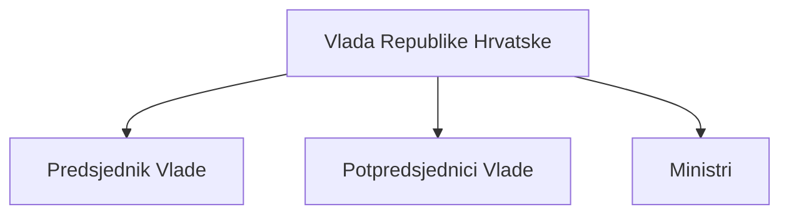
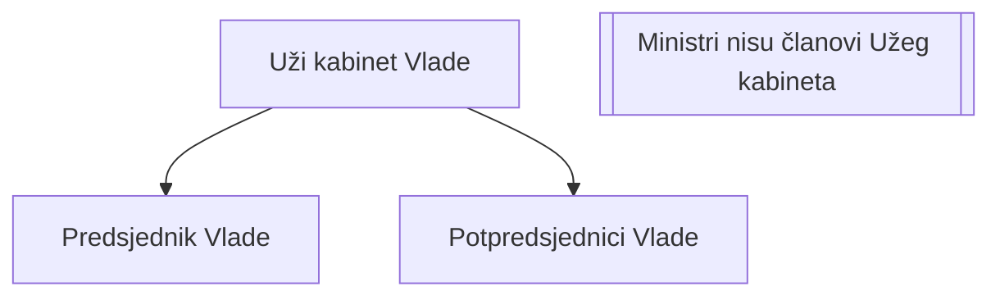
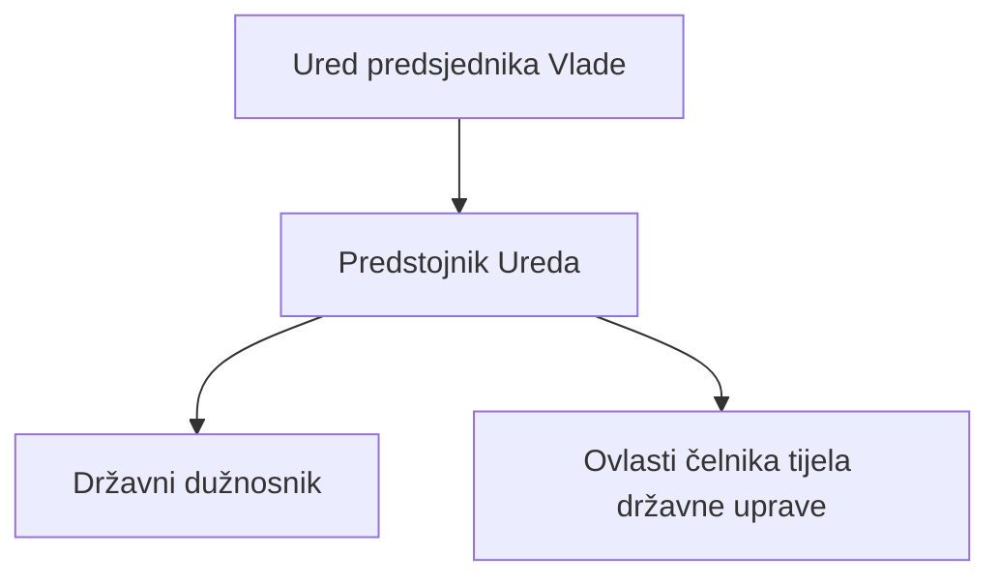
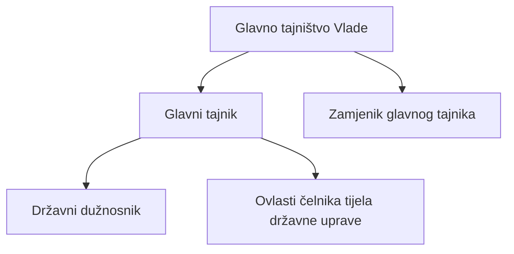
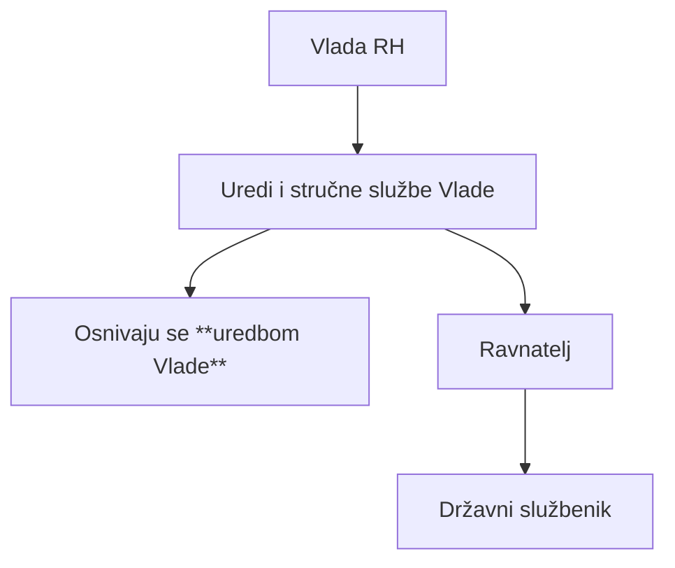
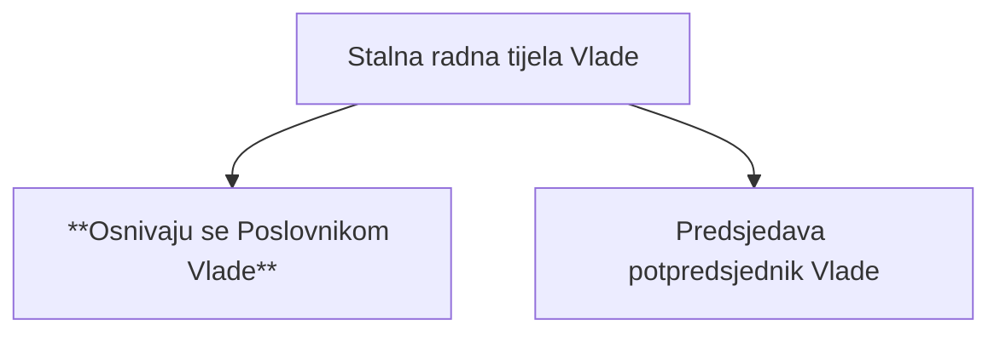
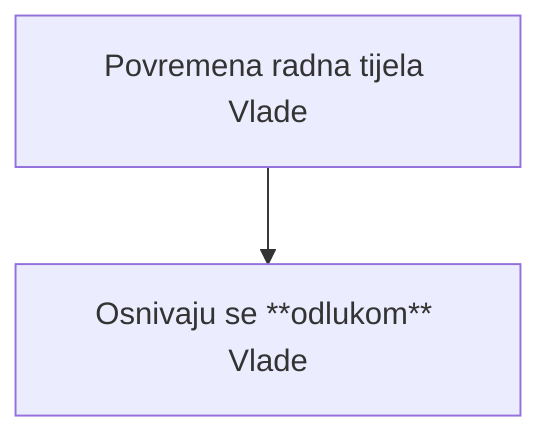
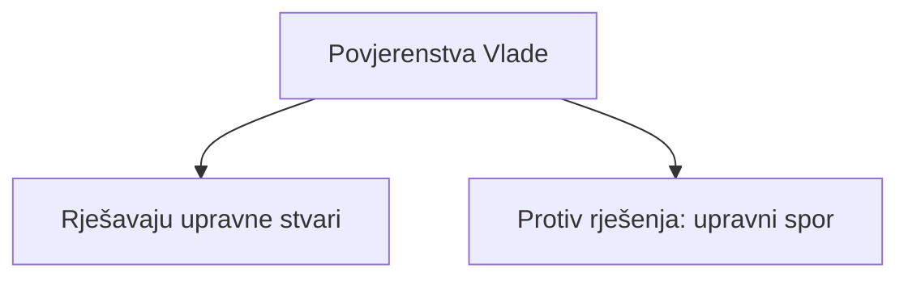
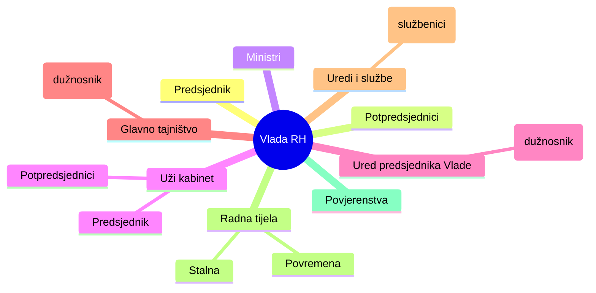

# Vlada Republike Hrvatske – tijela u sastavu (dijagrami)

---

## Vlada Republike Hrvatske – osnovna struktura

## Uži kabinet Vlade

## Ured predsjednika Vlade

## Glavno tajništvo Vlade

## Uredi i druge stručne službe Vlade

## Stalna radna tijela Vlade

## Povremena radna tijela Vlade

## Povjerenstva Vlade

## Mentalna mapa – brzo ponavljanje

