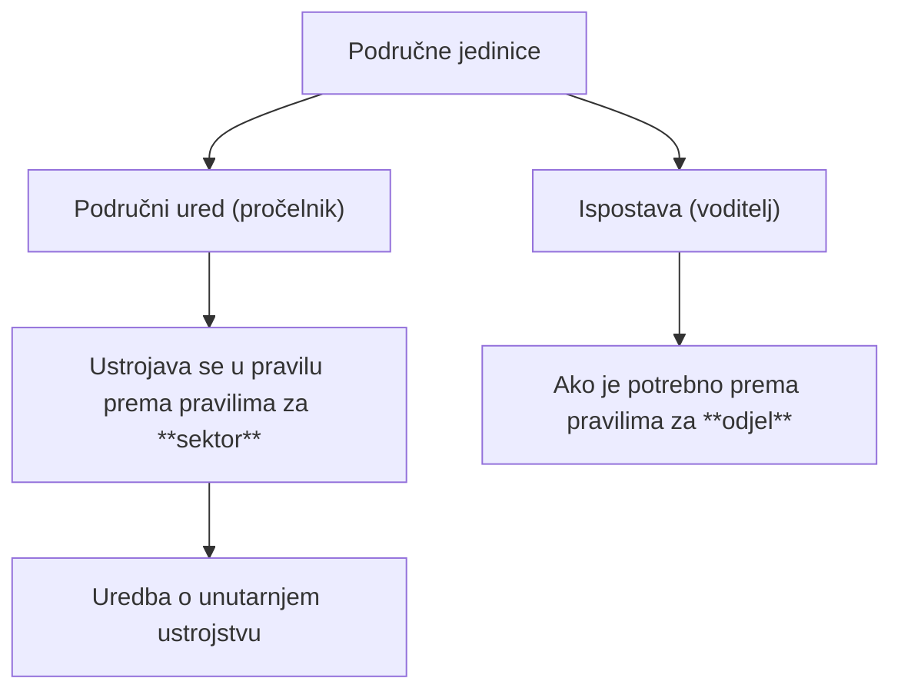

# Područne jedinice tijela državne uprave

## Brzi pregled  

> [!IMPORTANT]
> - Područne jedinice omogućuju obavljanje poslova državne uprave **na terenu** i prilagodbu **mjesnoj nadležnosti**.
> - Područne jedinice su: **područni uredi**, **područne službe**, **područni odjeli**, **ispostave** i **samostalni izvršitelji**.
> - Područne jedinice se u pravilu ustrojavaju kao **područni uredi**, prema pravilima za **sektor**.
> - Ako ne postoje uvjeti za područni ured, ustrojavaju se **područne službe ili područni odjeli**, prema pravilima za službu odnosno odjel.
> - Područne jedinice mogu obavljati poslove u **jednom ili više upravnih područja** i na području **jedne ili više županija**.
> - **Ispostave** se ustrojavaju izvan sjedišta područnog ureda, na području jedinica lokalne samouprave.
> - Ispostava mora imati **najmanje tri izvršitelja i voditelja**, uz moguće iznimke ako je to opravdano i obrazloženo.
> - Ako ne postoje uvjeti za ustrojavanje područnih jedinica, poslove mogu obavljati **samostalni izvršitelji**.
> - Sjedište područnog ureda je u pravilu u **sjedištu županije**, a sjedište ispostave u **sjedištu jedinice lokalne samouprave**.
> - Nazivi područnih ureda i ispostava moraju biti **jasni i prepoznatljivi**, uz mogućnost brojčanih ili geografskih oznaka.
> - Područnim uredom rukovodi **pročelnik**, a ispostavom **voditelj ispostave**.
> - Pročelnici i voditelji odgovaraju **ministru / državnom tajniku / čelniku DUO**, ali **ne Vladi RH**.

---
## Uvod

Područne jedinice omogućuju:
- obavljanje poslova državne uprave **na terenu**
- dostupnost građanima
- prilagodbu mjesnoj nadležnosti

Obuhvaćaju:
- **područne urede**
- **područne službe**
- **područne odjele**
- **ispostave**
- **samostalne izvršitelje**

> [!TIP]
> Ovo je tipična ispitna cjelina s pitanjima tipa:
> - *što se osniva kad ne postoje uvjeti*
> - *tko kime rukovodi*
> - *gdje je sjedište*

---

## 1. Područni uredi

### Ustrojavanje područnih ureda

Područne jedinice se u pravilu ustrojavaju kao **područni uredi**.

- ustrojavaju se uz odgovarajuću primjenu:
  - Uredbe o općim pravilima za unutarnje ustrojstvo tijela državne uprave (NN 70/2019)
  - **odredbi koje se primjenjuju na ustrojavanje sektora**

Ako **ne postoje uvjeti** za ustrojavanje područnog ureda:
- osnivaju se:
  - **područne službe**
  - ili **područni odjeli**
- prema pravilima za:
  - službe
  - odnosno odjele

> [!WARNING]
> **Ispitno bitno**
> 
> Područni ured → pravila za **sektor**  
> Područna služba / odjel → pravila za **službu / odjel**

---

## 2. Obavljanje poslova područnih jedinica

Područne jedinice:
- obavljaju poslove u:
  - jednom ili više upravnih područja
- na području:
  - jedne ili više jedinica područne (regionalne) samouprave

---

## 3. Ispostave

### Ustrojavanje ispostava

Na području:
- jedne ili više jedinica **lokalne samouprave**
- izvan sjedišta područnog ureda

mogu se ustrojiti **ispostave** radi:
- neposrednog obavljanja poslova iz djelokruga područnog ureda

Minimalni uvjet:
- ispostava mora imati:
  - **najmanje tri izvršitelja**
  - + **voditelja ispostave**

> [!WARNING]
> **Točan odgovor na ispitu:**  
> ✔️ tri izvršitelja i voditelj

---

### Iznimke – manji broj izvršitelja

Upravne organizacije u sastavu ministarstava ili DUO:
- mogu ustrojiti ispostavu i s **manje od četiri izvršitelja**

Uvjet:
- mora biti:
  - opravdano posebnim uvjetima rada
  - nužno za redovito obavljanje poslova
  - obrazloženo na odgovarajući način

---

## 4. Samostalni izvršitelji

Ako **ne postoje uvjeti** za ustrojavanje:
- područnih ureda
- područnih službi
- ispostava

poslove državne uprave na području jedne ili više jedinica područne (regionalne) samouprave mogu obavljati:
- **samostalni izvršitelji**

> [!NOTE]
> Samostalni izvršitelj = krajnja organizacijska mjera

---

## 5. Mjesna nadležnost područnih jedinica

Za određivanje mjesne nadležnosti:
- ključna je primjena propisa:
  - kojima se utvrđuje **područno ustrojstvo Republike Hrvatske**

---

## 6. Sjedišta područnih jedinica

### Sjedište područnog ureda
- u pravilu:
  - u sjedištu jedinice područne (regionalne) samouprave
- ili:
  - u jednoj od jedinica područne samouprave za čije je područje ustrojen

### Sjedište ispostave
- u pravilu:
  - u jedinici lokalne samouprave
  - za čije je područje ispostava ustrojena

> [!WARNING]
> **Ispitna zamka**
> 
> Sjedište područnog ureda ≠ sjedište ispostave

---

## 7. Nazivi područnih jedinica

### Nazivi područnih ureda
- moraju biti:
  - kratki
  - jasni
- ako se radi o sjedištu područnog ureda:
  - naziv mora sadržavati naziv jedinice područne (regionalne) samouprave
- može sadržavati:
  - naznaku jednog ili više upravnih područja

### Nazivi ispostava
- moraju sadržavati:
  - prepoznatljiv dio naziva jedinice lokalne samouprave
  - u kojoj je sjedište ispostave

---

## 8. Više ispostava u istoj jedinici lokalne samouprave

Ako se za obavljanje istovrsnih poslova:
- osniva više ispostava
- u istoj jedinici lokalne samouprave

tada nazivi ispostava moraju sadržavati:
- **brojčanu oznaku**
- ili **geografsku odrednicu**

---

## 9. Rukovođenje područnim uredom

### Tko rukovodi
- područnim uredom rukovodi **pročelnik**

### Odgovornost pročelnika
Pročelnik odgovara:
- ministru
- nadležnom državnom tajniku
- rukovoditelju upravne organizacije  
  (ako je područni ured ustrojen u sastavu upravne organizacije)

---

## 10. Rukovođenje područnim uredom u sastavu DUO

Ako je područni ured:
- osnovan za pojedinu državnu upravnu organizaciju

rukovoditelj odgovara:
- čelniku državne upravne organizacije
- njegovom zamjeniku

Ako su područni uredi ustrojeni kao:
- područne službe ili
- područni odjeli

njima rukovode:
- **voditelji**

---

## 11. Rukovođenje ispostavom

### Tko rukovodi
- ispostavom rukovodi **voditelj ispostave**

### Odgovornost (u sastavu ministarstva)
Voditelj ispostave odgovara:
- ministru
- nadležnom državnom tajniku
- rukovoditelju upravne organizacije
- rukovoditelju područnog ureda  
  (ako je ispostava u njegovu sastavu)

### Odgovornost (u sastavu DUO)
Voditelj ispostave odgovara:
- čelniku državne upravne organizacije
- njegovom zamjeniku
- rukovoditelju područnog ureda  
  (ako je ispostava u njegovu sastavu)

> [!WARNING]
> **Ispitna zamka**
> 
> Voditelj ispostave **NE odgovara Vladi RH**

---

## 12. Brzi ispitni sažetak

- Područni ured → pravila za sektor
- Ako nema uvjeta → područna služba / odjel
- Ispostava → 3 izvršitelja + voditelj
- Samostalni izvršitelj → kad ništa drugo nije moguće
- Pročelnik → rukovodi područnim uredom
- Voditelj → rukovodi ispostavom
- Sjedišta i nazivi → česta pitanja s „da / ne“

