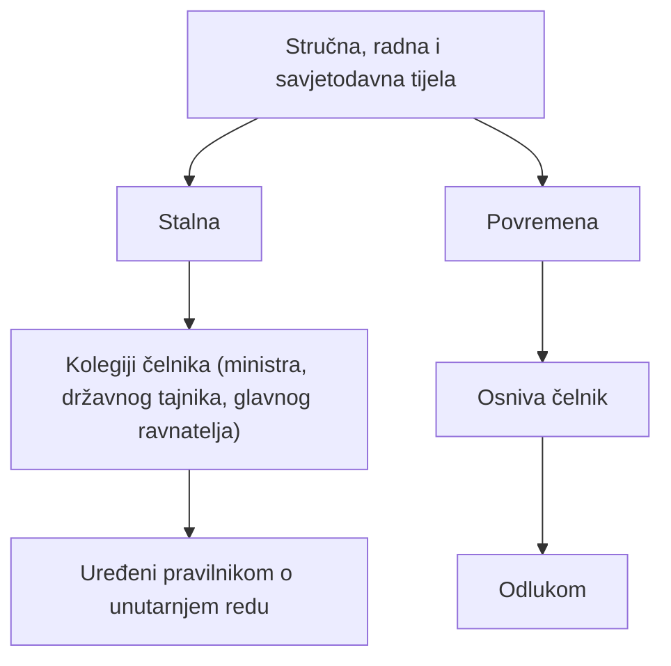

# Stručna, radna i savjetodavna tijela te planiranje poslova

## Brzi pregled  

> [!IMPORTANT]
> - U tijelima državne uprave postoje **stalna** i **povremena stručna, radna i savjetodavna tijela**.
> - **Stalna stručna i savjetodavna tijela** su **kolegiji čelnika tijela** (ministra, državnog tajnika, glavnog ravnatelja).
> - Rad stalnih savjetodavnih tijela uređen je **pravilnikom o unutarnjem redu**.
> - **Povremena savjetodavna i radna tijela** osniva **čelnik tijela državne uprave** svojom **odlukom**.
> - Povremena tijela mogu biti **radne skupine** i **stručna ili savjetodavna povjerenstva**.
> - Povremena tijela **izrađuju nacrte i prijedloge**, ali **ne donose provedbene propise**.
> - Tjedno radno vrijeme traje **5 dana**, a dnevno **8 sati** (u pravilu 7:30–16:30).
> - **Radno vrijeme** uređuje se pravilnikom o unutarnjem redu.
> - **Uredovno vrijeme** je vrijeme rada sa strankama i **ne mora se poklapati** s radnim vremenom.
> - Ako se poslovi obavljaju izvan sjedišta tijela ili područnih jedinica, mogu se odrediti **uredovni dani**.
> - **Uredovne dane** određuje čelnik tijela svojom odlukom, koja se objavljuje na mrežnim stranicama.
> - Uredovni dani **nisu** redovni radni dani tijela državne uprave.

---
## Uvod

Po završetku ove cjeline potrebno je:
- prepoznati **stručna, radna i savjetodavna tijela** u tijelima državne uprave
- razlikovati:
  - stalna
  - povremena tijela
- znati **način osnivanja i njihove poslove**
- razumjeti:
  - raspored radnog vremena
  - uredovno vrijeme
  - uredovne dane

> [!TIP]
> Ovdje se često ispituje:
> - *tko osniva tijelo*
> - *što ta tijela smiju, a što ne*
> - *razlika radnog i uredovnog vremena*

---

## 1. Stalna stručna i savjetodavna tijela

### Pojam

Stalno stručno i savjetodavno tijelo:
- djeluje **trajnim karakterom**
- u sustavu državne uprave
- kolegij je **čelnika tijela državne uprave**

### Primjeri stalnih stručnih i savjetodavnih tijela
- **kolegij ministra**
- **kolegij državnog tajnika**
- **kolegij glavnog ravnatelja**

Rad ovih tijela:
- uređen je **pravilnikom o unutarnjem redu**

> [!WARNING]
> **Ispitno bitno**
> 
> Stalna savjetodavna tijela = kolegiji  
> (ne radne skupine, ne povjerenstva)

---

## 2. Povremena savjetodavna i radna tijela

### Osnivanje

U tijelima državne uprave mogu se osnovati:
- **povremena savjetodavna i radna tijela**

Osniva ih:
- **čelnik tijela državne uprave**
- svojom **odlukom**

> [!NOTE]
> Ne osniva ih Vlada, nego čelnik tijela.

---

## 3. Poslovi povremenih savjetodavnih i radnih tijela

Zadaci mogu biti:
- izrada nacrta:
  - prijedloga zakona
  - prijedloga uredbi
  - drugih akata Vlade
- izrada prijedloga provedbenih propisa ❌ *(NE – vidi ispod)*
- izrada nacrta akata strateškog planiranja
- prikupljanje podataka i izrada stručnih podloga
- analiza i izvješća o stanju u određenom upravnom području
- davanje prijedloga i mišljenja o pitanjima iz djelokruga tijela državne uprave

> [!WARNING]
> **Ispitna zamka**
> 
> Povremena savjetodavna i radna tijela **NE DONOSE** provedbene propise.  
> Ona izrađuju **nacrte**, ne donose propise.

---

## 4. Primjeri savjetodavnih i radnih tijela – grupirano

### A) Radne skupine

Primjeri:
- radna skupina za izradu izmjena i dopuna Zakona o kaznenom postupku
- radna skupina za izradu Zakona o Pravosudnoj akademiji
- radna skupina za izradu prijedloga nacrta Strategije sprječavanja korupcije (2021.–2030.)

---

### B) Savjetodavna i stručna povjerenstva

Primjeri:
- stručno povjerenstvo za monografije iz područja kulture i umjetnosti
- povjerenstvo za praćenje provedbe Nacionalne strategije poticanja čitanja
- povjerenstvo za unapređenje odgojno-obrazovnih radnika

---

### C) Što savjetodavna i radna tijela MOGU biti

Točni odgovori:
- ✔️ stručna povjerenstva
- ✔️ savjetodavna povjerenstva
- ✔️ radne skupine

Nisu:
- samostalne službe
- savjetodavni sektori

---

## 5. Tjedno i dnevno radno vrijeme

### Tjedno radno vrijeme
- u pravilu:
  - **5 radnih dana**
  - od **ponedjeljka do petka**

### Dnevno radno vrijeme
- traje:
  - **8 sati**
- u pravilu:
  - između **7:30 i 16:30**

Radno vrijeme:
- pobliže se uređuje:
  - **pravilnikom o unutarnjem redu**

---

## 6. Uredovno vrijeme

### Pojam

Uredovno vrijeme je:
- vrijeme namijenjeno **radu sa strankama**

Određuje se tako da:
- strankama omogući pristup tijelima državne uprave
- **svakog radnog dana**

### Odnos prema radnom vremenu
- uredovno vrijeme:
  - ne mora se poklapati s dnevnim radnim vremenom
  - može trajati **kraće**

> [!WARNING]
> **Ispitna zamka**
> 
> Uredovno vrijeme ≠ dnevno radno vrijeme

---

## 7. Uredovni dani

### Kada se određuju

Ako se poslovi državne uprave:
- obavljaju izvan sjedišta tijela državne uprave
- ili izvan sjedišta njihovih područnih jedinica

mogu se:
- odrediti **uredovni dani**

### Tko ih određuje
- **čelnik tijela državne uprave**
- svojom **odlukom**

Odluka sadrži:
- koje se poslove obavlja
- mjesto obavljanja
- vrijeme uredovnih dana

Objava:
- na mrežnim stranicama tijela državne uprave

---

## 8. Što uredovni dani NISU

Točan odgovor:
- ✔️ **ništa od navedenog**

Uredovni dani:
- nisu redovni radni dani tijela
- nisu dani koje određuje Hrvatski sabor
- nisu opći dani rada državne uprave

---

## 9. Brzi ispitni sažetak

- Stalna savjetodavna tijela → kolegiji
- Povremena tijela → osniva čelnik
- Povremena tijela:
  - izrađuju nacrte
  - ne donose propise
- Radno vrijeme → 8 h (7:30–16:30)
- Uredovno vrijeme → rad sa strankama
- Uredovni dani → izvan sjedišta, posebna odluka

> [!TIP]
> Ako razlikuješ:
> **radno vrijeme – uredovno vrijeme – uredovne dane**,  
> ovaj dio ispita rješavaš bez razmišljanja.

