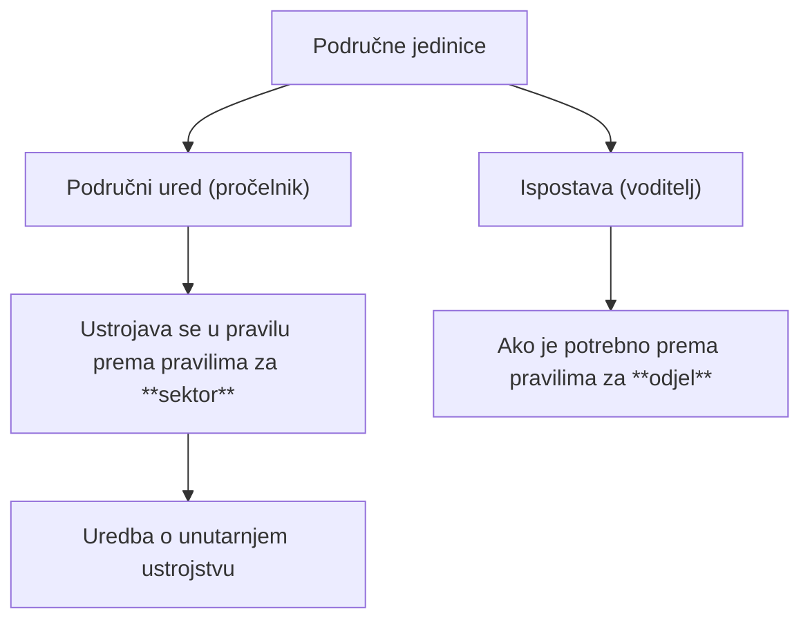

# Područne jedinice tijela državne uprave

## Brzi pregled

> [!IMPORTANT]
> - Područne jedinice omogućuju obavljanje poslova državne uprave **na terenu** i prema **mjesnoj nadležnosti**.
> - Područne jedinice su: **područni uredi**, **područne službe**, **područni odjeli**, **ispostave** i **samostalni izvršitelji**.
> - Područne jedinice se u pravilu ustrojavaju kao **područni uredi**, prema pravilima za **sektor**.
> - Ako ne postoje uvjeti za područni ured, ustrojavaju se **područne službe ili područni odjeli**.
> - **Ispostave** se ustrojavaju izvan sjedišta područnog ureda, na području jedinica lokalne samouprave.
> - Ispostava mora imati **najmanje tri izvršitelja i voditelja**.
> - Ako nema uvjeta ni za jednu područno-organizacijsku formu, poslove obavljaju **samostalni izvršitelji**.
> - Područnim uredom rukovodi **pročelnik**, a ispostavom **voditelj ispostave**.
> - Rukovoditelji **ne odgovaraju Vladi RH**.

---

## Uvod

Radi osiguranja dostupnosti i učinkovitog obavljanja poslova državne uprave, tijela državne uprave ustrojavaju **područne jedinice**. One omogućuju:
- neposredno obavljanje poslova
- prilagodbu teritorijalnom ustrojstvu Republike Hrvatske
- bolju dostupnost građanima

Područne jedinice su organizacijski oblici, a **ne posebna tijela državne uprave**.

> [!TIP]
> Ovo je izrazito **ispitno frekventna** cjelina – često se pita:
> - redoslijed ustrojavanja
> - razlika u rukovođenju
> - minimalni kadrovski uvjeti

---

## 1. Područni uredi

### Ustrojavanje

Područne jedinice se **u pravilu** ustrojavaju kao **područni uredi**.

- ustrojavaju se uz odgovarajuću primjenu:
  - Uredbe o općim pravilima za unutarnje ustrojstvo tijela državne uprave
  - odredbi koje se primjenjuju na **ustrojavanje sektora**

Ako **ne postoje uvjeti** za ustrojavanje područnog ureda:
- osnivaju se:
  - **područne službe**
  - ili **područni odjeli**
- prema pravilima za:
  - službu
  - odnosno odjel

> [!WARNING]
> **Ispitno bitno**
> 
> - Područni ured → pravila za **sektor**
> - Područna služba / odjel → pravila za **službu / odjel**

---

## 2. Obavljanje poslova područnih jedinica

Područne jedinice:
- mogu obavljati poslove u:
  - jednom ili više upravnih područja
- na području:
  - jedne ili više jedinica područne (regionalne) samouprave

---

## 3. Ispostave

### Ustrojavanje ispostava

Na području:
- jedne ili više jedinica **lokalne samouprave**
- izvan sjedišta područnog ureda

mogu se ustrojiti **ispostave** radi:
- neposrednog obavljanja poslova iz djelokruga područnog ureda

Minimalni uvjet:
- **tri izvršitelja**
- **voditelj ispostave**

> [!IMPORTANT]
> **Točan odgovor na ispitu**
>  
> ✔️ tri izvršitelja i voditelj

---

### Iznimke – manji broj izvršitelja

Ispostave u sastavu:
- ministarstava
- državnih upravnih organizacija (DUO)

mogu se ustrojiti i s:
- **manje od četiri izvršitelja**

Uvjet:
- posebni uvjeti rada
- nužnost za redovito obavljanje poslova
- obrazloženje u aktu o ustrojavanju

---

## 4. Samostalni izvršitelji

Ako ne postoje uvjeti za ustrojavanje:
- područnog ureda
- područne službe
- područne ispostave

poslove državne uprave mogu obavljati:
- **samostalni izvršitelji**

> [!NOTE]
> Samostalni izvršitelji su **krajnja organizacijska mogućnost**.

---

## 5. Mjesna nadležnost

Mjesna nadležnost područnih jedinica određuje se:
- primjenom propisa
- kojima se utvrđuje **područno ustrojstvo Republike Hrvatske**

---

## 6. Sjedišta područnih jedinica

### Sjedište područnog ureda
- u pravilu:
  - u sjedištu jedinice područne (regionalne) samouprave
- ili:
  - u jednoj od jedinica za čije je područje ustrojen

### Sjedište ispostave
- u pravilu:
  - u sjedištu jedinice lokalne samouprave
  - za čije je područje ispostava ustrojena

> [!WARNING]
> **Ispitna zamka**
>  
> Sjedište područnog ureda ≠ sjedište ispostave

---

## 7. Nazivi područnih jedinica

### Područni uredi
- naziv mora biti:
  - kratak
  - jasan
- ako se radi o sjedištu:
  - sadrži naziv jedinice područne (regionalne) samouprave
- može sadržavati:
  - naznaku jednog ili više upravnih područja

### Ispostave
- naziv mora sadržavati:
  - prepoznatljiv dio naziva jedinice lokalne samouprave

---

## 8. Više ispostava u istoj jedinici lokalne samouprave

Ako se osniva:
- više ispostava
- za istovrsne poslove
- u istoj jedinici lokalne samouprave

nazivi moraju sadržavati:
- **brojčanu oznaku**
- ili **geografsku odrednicu**

---

## 9. Rukovođenje područnim uredom (ministarstvo)

Područnim uredom rukovodi:
- **pročelnik**

Pročelnik odgovara:
- ministru
- nadležnom državnom tajniku
- rukovoditelju upravne organizacije  
  (ako je ured u njezinu sastavu)

---

## 10. Rukovođenje područnim uredom (DUO)

Ako je područni ured osnovan:
- za pojedinu državnu upravnu organizaciju

rukovoditelj odgovara:
- čelniku DUO
- njegovom zamjeniku

Ako su ustrojeni:
- područne službe ili
- područni odjeli

njima rukovode:
- **voditelji**

---

## 11. Rukovođenje ispostavom

Ispostavom rukovodi:
- **voditelj ispostave**

Voditelj ispostave odgovara:
- ministru
- nadležnom državnom tajniku
- čelniku DUO ili njegovu zamjeniku
- rukovoditelju područnog ureda  
  (ako je ispostava u njegovu sastavu)

> [!WARNING]
> **Ispitno bitno**
>  
> Voditelj ispostave **NE odgovara Vladi RH**

---

## Sažetak

> [!NOTE]
> - Područne jedinice omogućuju rad državne uprave na terenu.
> - Područni ured je osnovni oblik ustrojavanja.
> - Ako nema uvjeta → područna služba / odjel → ispostava → samostalni izvršitelj.
> - Ispostava mora imati najmanje tri izvršitelja i voditelja.
> - Pročelnik vodi područni ured, voditelj vodi ispostavu.
> - Rukovoditelji ne odgovaraju Vladi RH.

