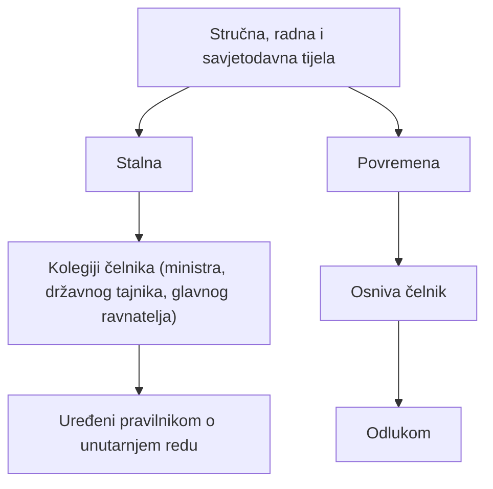

# Stručna, radna i savjetodavna tijela te planiranje poslova

## Brzi pregled

> [!IMPORTANT]
> - U tijelima državne uprave postoje **stalna** i **povremena stručna, radna i savjetodavna tijela**.
> - **Stalna stručna i savjetodavna tijela** su **kolegiji čelnika tijela**.
> - Rad stalnih tijela uređuje se **pravilnikom o unutarnjem redu**.
> - **Povremena savjetodavna i radna tijela** osniva **čelnik tijela** svojom **odlukom**.
> - Povremena tijela izrađuju **nacrte, prijedloge i analize**, ali **ne donose provedbene propise**.
> - Radno vrijeme u pravilu traje **8 sati dnevno**, **5 dana tjedno**.
> - **Uredovno vrijeme** je vrijeme rada sa strankama i ne mora se poklapati s radnim vremenom.
> - Ako se poslovi obavljaju izvan sjedišta tijela, mogu se odrediti **uredovni dani**.

---

## Uvod

U tijelima državne uprave, radi kvalitetnog obavljanja poslova i pripreme odluka, osnivaju se različita **stručna, radna i savjetodavna tijela**. Ona mogu imati **stalni** ili **povremeni** karakter, a razlikuju se prema:
- načinu osnivanja
- trajanju
- vrsti poslova koje obavljaju

Osim toga, ova cjelina obuhvaća i:
- raspored **radnog vremena**
- pojam **uredovnog vremena**
- institut **uredovnih dana**

> [!TIP]
> Na ispitu se često provjerava:
> - razlika **stalnih i povremenih tijela**
> - **tko ih osniva**
> - **što smiju, a što ne smiju raditi**
> - razlika između **radnog** i **uredovnog vremena**

---

## 1. Stalna stručna i savjetodavna tijela

### Pojam

**Stalna stručna i savjetodavna tijela**:
- imaju **trajni karakter**
- djeluju unutar tijela državne uprave
- predstavljaju **kolegijalna tijela čelnika**

### Primjeri

Stalna stručna i savjetodavna tijela su:
- **kolegij ministra**
- **kolegij državnog tajnika**
- **kolegij glavnog ravnatelja**

Njihov rad:
- uređen je **pravilnikom o unutarnjem redu**

> [!IMPORTANT]
> **Ispitno bitno**
>  
> Stalna savjetodavna tijela = **kolegiji čelnika**  
>  
> ❌ nisu radne skupine  
> ❌ nisu povjerenstva

---

## 2. Povremena savjetodavna i radna tijela

### Osnivanje

U tijelima državne uprave mogu se osnovati **povremena savjetodavna i radna tijela**.

Osniva ih:
- **čelnik tijela državne uprave**
- svojom **odlukom**

> [!NOTE]
> Povremena tijela ne osniva Vlada, nego **čelnik konkretnog tijela**.

---

## 3. Poslovi povremenih savjetodavnih i radnih tijela

Povremena savjetodavna i radna tijela mogu obavljati sljedeće poslove:
- izradu nacrta prijedloga:
  - zakona
  - uredbi
  - drugih akata Vlade
- izradu nacrta akata strateškog planiranja
- prikupljanje podataka i izradu stručnih podloga
- analizu i izradu izvješća o stanju u određenom upravnom području
- davanje prijedloga i mišljenja o pitanjima iz djelokruga tijela državne uprave

Ne mogu:
- ❌ **donositi provedbene propise**

> [!WARNING]
> **Česta ispitna zamka**
>  
> Povremena tijela **izrađuju nacrte**, ali **ne donose propise**.

---

## 4. Primjeri savjetodavnih i radnih tijela

### Radne skupine

Primjeri:
- radna skupina za izradu izmjena i dopuna Zakona o kaznenom postupku
- radna skupina za izradu Zakona o Pravosudnoj akademiji
- radna skupina za izradu Strategije sprječavanja korupcije

### Savjetodavna i stručna povjerenstva

Primjeri:
- stručno povjerenstvo za monografije iz područja kulture i umjetnosti
- povjerenstvo za praćenje provedbe nacionalnih strategija
- povjerenstvo za unapređenje odgojno-obrazovnih radnika

### Što mogu biti savjetodavna i radna tijela

Mogu biti:
- stručna povjerenstva
- savjetodavna povjerenstva
- radne skupine

Ne mogu biti:
- samostalne službe
- savjetodavni sektori

---

## 5. Radno vrijeme

### Tjedno radno vrijeme

Radno vrijeme u tijelima državne uprave:
- u pravilu traje **5 radnih dana**
- od **ponedjeljka do petka**

### Dnevno radno vrijeme

Dnevno radno vrijeme:
- traje **8 sati**
- u pravilu između **7:30 i 16:30**

Radno vrijeme se:
- pobliže uređuje **pravilnikom o unutarnjem redu**

---

## 6. Uredovno vrijeme

### Pojam

**Uredovno vrijeme** je:
- vrijeme namijenjeno **radu sa strankama**

Određuje se tako da:
- strankama omogući pristup tijelima državne uprave svakog radnog dana

Uredovno vrijeme:
- ne mora se poklapati s dnevnim radnim vremenom
- može trajati kraće od punog radnog vremena

> [!IMPORTANT]
> **Ispitno bitno**
>  
> Uredovno vrijeme ≠ radno vrijeme

---

## 7. Uredovni dani

Ako se poslovi državne uprave obavljaju:
- izvan sjedišta tijela
- ili izvan sjedišta područnih jedinica

mogu se odrediti **uredovni dani**.

Uredovne dane određuje:
- **čelnik tijela državne uprave**
- svojom **odlukom**

Odluka sadrži:
- vrstu poslova
- mjesto obavljanja
- vrijeme uredovnih dana

Objavljuje se:
- na mrežnim stranicama tijela državne uprave

---

## Sažetak

> [!NOTE]
> - Stalna stručna i savjetodavna tijela su **kolegiji čelnika**.
> - Povremena savjetodavna i radna tijela osniva **čelnik tijela odlukom**.
> - Povremena tijela izrađuju **nacrte i prijedloge**, ali **ne donose propise**.
> - Radno vrijeme traje **8 sati dnevno**, **5 dana tjedno**.
> - Uredovno vrijeme je vrijeme rada sa strankama.
> - Uredovni dani određuju se za rad izvan sjedišta tijela.

